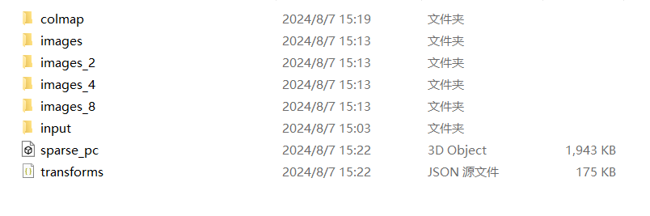
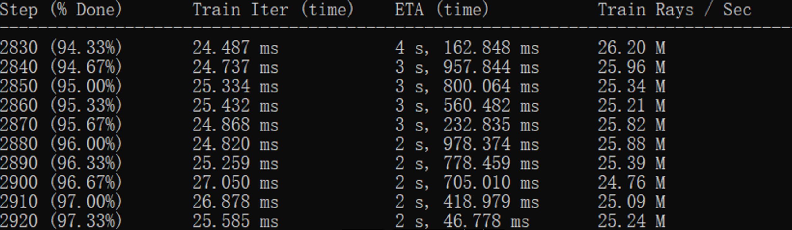
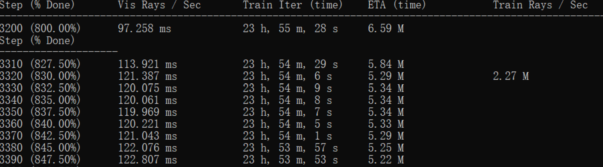
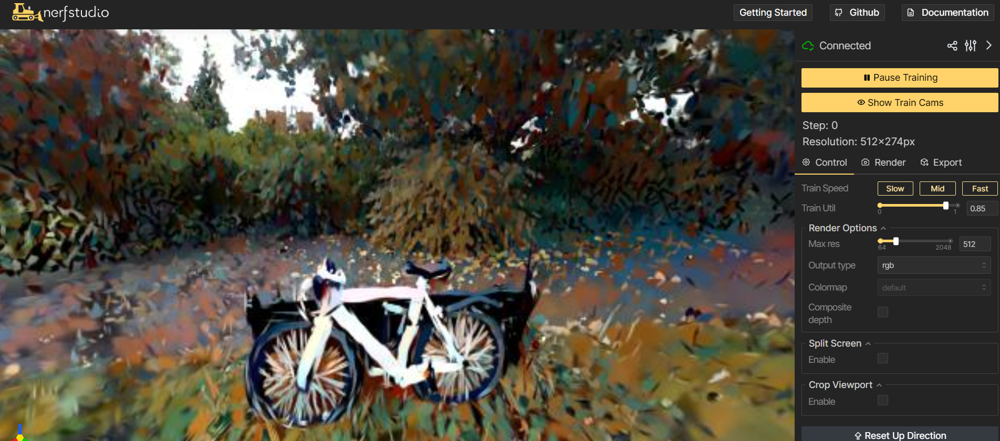
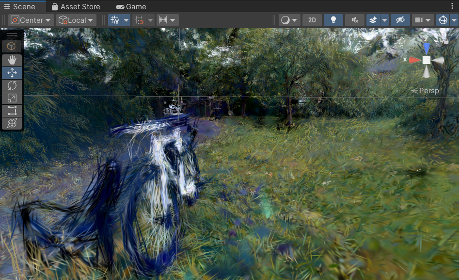

# StyleTransferGS
The project is to construct to Style transfer 3DGS
## Video Demonstration
* The video demonstration is available to view [here](https://youtu.be/33Z2bZXNBrI).
## Introduction
<p align="center">
    
</p>
<p align="center">
    <b>Fig:  The result in Unity</b>
</p>

This project was built on top of [gaussian splatting for nerfstudio](https://github.com/jonstephens85/nerfstudio_guassians)
, which incorperates [gsplat](https://github.com/nerfstudio-project/gsplat) to train gaussian splats instead of the offical version of "3D Gaussian Splatting for Real-Time Radiance Field Rendering". The new method of gsplat reduces GPU memory usage and speeds up the training process.


* The aim of the project is to support the feature of Style transfer.
* A new expansion for the command ns-train, splatfactoStyle, is added for Stylizing 3DGS


## Technique
Features in the project are list as follows:

**3D Gaussian Splatting**: a technology of 3D reconstruction with point cloud data trained by 3D Gaussian distribution.

**Neural Style Transfer** : Use Vgg19 to extract feature maps from output and reference image, then decrease the discrepency of corresponding Gram matrice.

## Installation
Please refer to the following link and video for the installation environment (**there are some pitfalls!!!**). If this is your frist time, it's recommend to watch the video fist：

Video:[How to install Nerfstudio 2024](https://www.youtube.com/watch?v=3JIpZd5XNAc)

Github: 
[nerfstudio_guassians from jonstephens85](https://github.com/jonstephens85/nerfstudio_guassians)


nerfstudio installation [quickstart](https://github.com/nerfstudio-project/nerfstudio/blob/main/docs/quickstart/installation.md#dependencies)

if you encounter some erros during installation, pay attention on the following checklist (not sure if some of them has been fixed, most of them are caused by unmatched version):


* [install tiny cuda issue](https://github.com/NVlabs/tiny-cuda-nn/issues/280) (search vcvars64.bat)
* Don’t install the 17.10+ version visual studio, instead use the 17.9 version!
* SET DISTUTILS_USE_SDK=1 # Windows only
* don’t update setuptools to the latest version(last time it failed), instead use following: pip install setuptools==69.5.1
* if encounter gsplat error when training, [try reinstall gsplat](https://github.com/nerfstudio-project/gsplat) 

Follow the [Nerfstudio installation instruction](https://docs.nerf.studio/quickstart/installation.html) to install a conda environment. For convenience, here are the commands. it takes a long time to comile when installing tiny-cuda
```bash
# Create an isolated conda environment
conda create --name style_gs -y python=3.8
conda activate style_gs

# Install necessary NS dependencies
pip install torch==2.1.2+cu118 torchvision==0.16.2+cu118 --extra-index-url https://download.pytorch.org/whl/cu118

conda install -c "nvidia/label/cuda-11.8.0" cuda-toolkit

pip install ninja git+https://github.com/NVlabs/tiny-cuda-nn/#subdirectory=bindings/torch

# Insatll nerfstudio
git clone https://github.com/nerfstudio-project/nerfstudio.git
cd nerfstudio
pip install --upgrade pip setuptools
pip install -e .

# go to the the styleGS project folder, where pyproject.toml is
# git clone https://github.com/wj-bj/StyleTransferGS.git
cd splatfactoStyle
pip install -e .


```
if encounter gsplat error when doing command ns-train. try the following solution to reinstall gsplat
```bash
#if encounter gsplat error when doing command ns-train. try the following solution
pip uninstall gsplat
pip install git+https://github.com/nerfstudio-project/gsplat.git
```
## Project hierarchy
In oder to expand nerfstudio,  run "pip install -e ."  in the project folder
```commandline
📦project
 ┃ 📜pyproject.toml             // install and register inito nerfstudio
 ┣ 📂splatfactoStyle
 ┃ ┣ 📂utils
 ┃ ┃ ┣ 📜loss_utils.py          // helpful loss functions                
 ┃ ┣ 📜model.py                  //Implementation of training                     
 ┃ ┣ 📜splatfactoStyle_config.py //"splatfactoStyle" configuration  
 ┣ 📂nerfstudio                 
 ┃ ┣ 📂scripts                      
 ┃ ┃ ┣ exporter.py               //  used for export .ply file 
 ┣ 📂data                       // The fold for input data
 ┣ 📂outputs                    // The fold for ouput result 
 ┣ 📂...                       
 ```
#### Explanation
exporter.py need to replace the same file in Nerfstuido project, as the original file has limitation when exporting ply file


##  DataSet
You can download the datasets of bicycle [here](https://drive.google.com/file/d/15lSwdbKBWuicjneRHSlTkQV9tqHqwjLy/view?usp=sharing), unzip it and place the folder into the data folder for input.

some style images for stylization [here](https://drive.google.com/file/d/1nY2RaPTkzkBiwnfKpSqsRKeypz4Reox1/view?usp=sharing) and place this folder into into the data folder for input. 
##  Operation Instruction

You can find the explainaion of some commands: [here](https://docs.nerf.studio/reference/cli/index.html)


1.Preprocess video or images,converting video into images, use COLMAP to generate camera data  and point cloud
<br> 
```bash
ns-process-data images --data data/mydata/bicycle/input --output-dir data/mydata/bicycle
 ```
<p align="center">
    
</p>
<p align="center">
    <b>Fig.1: output folders</b>
</p>

2.Gaussian Splatting trainning with orignial content<br>
```bash
ns-train splatfacto --max-num-iterations 3000 --data data/mydata/bicycle
```
#### Explanation of Command Parameters:
**`max-num-iterations`**: Specifies the maximum number of iterations for this training session, make sure it is greater than 3000<br>
**`data`**: Points to the folder containing the content images that will be used in the training process.<br>
 <p align="center">
    
</p>
<p align="center">
    <b>Fig.2: training process</b>
</p>

3.Stylized Gaussian splatting training, based on the model of previous result<br>
 ```bash
 ns-train splatfactoStyle --max-num-iterations 400 --data data/mydata/bicycle --load-dir outputs/bicycle/splatfacto/2024-08-07_152903/nerfstudio_models --pipeline.model.style-path data/style/starrynight.jpg
 ```
#### Explanation of Command Parameters:
**`max-num-iterations`**: Specifies the maximum number of iterations for this training session, make sure it is greater than 400<br>
**`data`**: Points to the folder containing the content images that will be used in the training process.<br>
**`load-dir`**: Specifies the directory from which to load the checkpoint of the previously trained model. This ensures that the current training starts from where the previous session ended<br>
**`pipeline.model.style-path`**: Provides the file path to the reference image that will be used to apply the desired style during the stylized training process

<p align="center">
   
</p>
<p align="center">
    <b>Fig.3: training process</b>
</p>

4.View the result in a web browser
```bash
ns-viewer --load-config "G:\Project\Nerf\nerfstudio\outputs\bicycle\splatfactoStyle\2024-07-30_133908\config.yml"
```
<p align="center">
   
</p>
<p align="center">
    <b>Fig.4: View the result in browser</b>
</p>

5.Export Trained Gaussian Splats into PLY File<br>
```bash
ns-export gaussian-splat --load-config "G:\Project\Nerf\nerfstudio\outputs\bicyclesplatfactoStyle\2024-08-07_160813\config.yml" --output-dir data/mydata/bicycle
```

To import the exported ply file into Unity, A plug-in needs to be installed. It can be acquired from [here](https://github.com/aras-p/UnityGaussianSplatting)
<p align="center">
   
</p>
<p align="center">
    <b>Fig.4: View the result in Unity</b>
</p>


